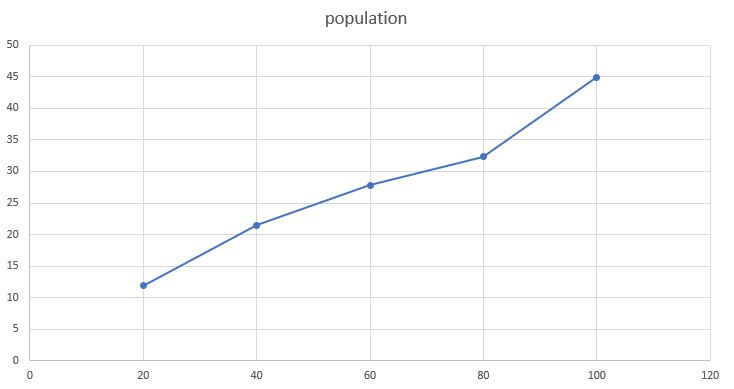
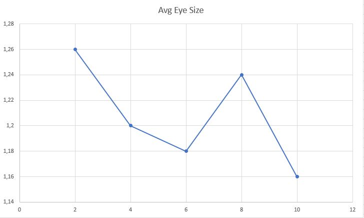
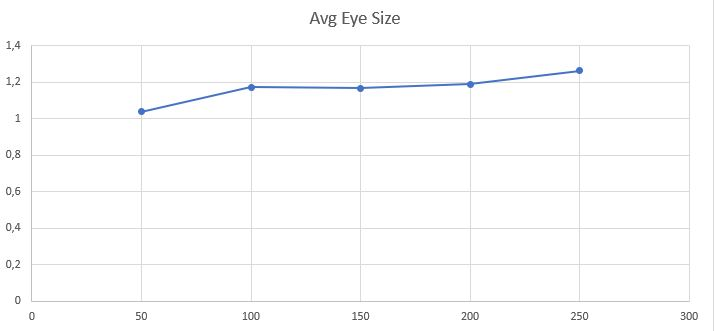

## Імітаційне моделювання комп'ютерних систем
## СПм-21-2, Іваненко Юлія Вікторівна
### Додаткова лабораторна робота №1. Опис імітаційних моделей
 

## Обрана модель в середовищі NetLogo:
[Vision Evolution](http://www.netlogoweb.org/launch#http://www.netlogoweb.org/assets/modelslib/Sample%20Models/Biology/Evolution/Vision%20Evolution.nlogo)
 

### Вербальний опис моделі:
Ця модель досліджує потенційний зв'язок між переходом наших ранніх предків з води на сушу та еволюцією їхніх очей.
Близько 385 мільйонів років тому хребетні, що мешкали у підводному середовищі, почали еволюціонувати для життя на суші. Нещодавнє дослідження MacIver et al. (2017) припускає, що радикальна трансформація плавників у кінцівки ранніх тетраподів (хребетних з чотирма кінцівками) супроводжувалася радикальною зміною розміру очей. Це могло б різко збільшити простір зорового сприйняття цих тетраподів, що дозволило б їм спостерігати за чисельними джерелами їжі на суші і, таким чином, сприяло б їхньому відбору для кінцівок.
У цій моделі  досліджується взаємозв'язок між розміром очей і трансформацією плавників у кінцівки, а також появу наземних хребетних з великими очима.

Ця модель має на меті імітувати перехід хребетних тварин від життя під водою до життя на суші. Таким чином, половина світу в  симуляції знаходиться під водою, а інша половина - на суші. Агентами в  моделі є риби, які спочатку плавають під водою. 
Називаємо агентів в цій моделі рибами для спрощення, однак вважаємо їх хребетними тваринами, які знаходяться на межі переходу до наземного життя. 

Крім того, є й інші організми, на які полюють ці риби. У  моделі вони називаються їжею, але можемо вважати їх як безхребетних, які мешкають як у воді, так і на суші.

### Керуючі параметри:
- **initial-number-fish** - початкова кількість риб;
- **initial-number-food** - початкова кількість їжі;
- **energy-gain-from-food** - скільки одиниць енергії отримує риба, коли вона з'їдає їжу;
- **food-replenish-rate** - ймовірність появи нового корму на кожному часовому кроці;
- **eye-cost** - скільки енергії коштує наявність великих очей;
- **reproduction-rate** - ймовірність того, що риба розмножиться на кожному часовому кроці, а також кількість енергії, необхідної для розмноженн;
- **matation-rate** - наскільки сильно може мутувати кожна характеристика нащадків при розмноженні риби;
- **max-eye-size** - максимальний розмір очей риби, до якого вони можуть еволюціонувати;
- **show-vision?** - ввімкнути або вимкнути візуалізацію поля зору кожної риби.

### Внутрішні параметри:
- **eye-size**.  Розмір ока визначає розмір радіусу зору (від 1 до максимального розміру ока).
- **land-mobility**. Визначає, наскільки швидко та ефективно організм може пересуватися по суші (від 0 до 1).
- **land-food-preference**. Кожна риба надає перевагу їжі на суші порівняно з їжею у воді (від 0 до 1).
- **energy**. Кожна риба має рівень енергії.

### Критерії ефективності системи:
- Середній розмір очей у наземних 
- Середній розмір очей у водних
- Популяція риб
- Кількість їжі

 

## Обчислювальні експерименти

### 1. Вплив ймовірністі появи нового корму на кожному часовому кроці на середню кількість риб

Дослідимо залежність середньої кількості популяції риб протягом заданої кількості тактів від  ймовірністі появи нового корму на кожному часовому кроці, яку будемо змінювати у процесі симуляції. Експеримент при **food-replenish-rate** від 20 до 100 з шагом 20 одиниць. 

Інші параметри будуть фіксованими: 
- **initial-number-fish** - 50
- **initial-number-food** - 80
- **energy-gain-from-food** - 100
- **eye-cost** - 9
- **reproduction-rate** - 35%
- **matation-rate** - 0,1
- **max-eye-size** - 5
- **show-vision?** - true

<table>
<thead>
<tr><th>Ймовірністі появи нового корму на кожному часовому кроці</th><th>Середня кількість риб</th></tr>
</thead>
<tbody>
<tr><td>20</td><td>11,9</td></tr>
<tr><td>40</td><td>21,38</td></tr>
<tr><td>60</td><td>27,84</td></tr>
<tr><td>80</td><td>32,35</td></tr>
<tr><td>100</td><td>44,89</td></tr>
</tbody>
</table>

Графік демонструє, що при збільшені  ймовірністі появи нового корму на кожному часовому кроці, популяція риб майже лінійно збільшується. 

### 2. Залежність середньго розміру очей водних тетраподів від кількості енергії, яка необхідна для наявності великих очей
Дослідимо залежність середньго розміру очей водних тетраподів від кількості енергії, яку коштує наявність великих очей (**eye-cost**). Кількості енергії буде змінюватися наступним чином: 2, 4, 6, 8 та 10. Всього 5 симуляцій, кожна по 3000 тіків. 

Параметри системи, при яких здійснювалась симуляція:

- **initial-number-fish** - 50
- **initial-number-food** - 80
- **energy-gain-from-food** - 100
- **reproduction-rate** - 35%
- **matation-rate** - 0,1
- **max-eye-size** - 5
- **show-vision?** - true
- **food-replenish-rate** - 65%

<table>
<thead>
<tr><th>Кількості енергії, яка необхідна для наявності великих очей</th><th>Середній розмір очей водних тетраподів</th></tr>
</thead>
<tbody>
<tr><td>2</td><td>1,26</td></tr>
<tr><td>4</td><td>1,2</td></tr>
<tr><td>6</td><td>1,18</td></tr>
<tr><td>8</td><td>1,24</td></tr>
<tr><td>10</td><td>1,16</td></tr>
</tbody>
</table>

Графік демонструє, що при збільшені кількості енергії, яка необхідна для наявності великих очей, середній розмір очей у риб зменшується.

### 3. Залежність середнього розміру очей сухопутних тетраподів від початкової кількості їжі

Дослідимо середнього розміру очей сухопутних тетраподів від початкової кількості їжі.
Експеримент буде проходити при  **initial-number-food** = 50, 100, 150, 200, 250, та фіксованих параметрах системи:

- **initial-number-fish** - 50
- **energy-gain-from-food** - 100
- **reproduction-rate** - 35%
- **matation-rate** - 0,1
- **max-eye-size** - 5
- **show-vision?** - true
- **food-replenish-rate** - 65%

Всього 5 симуляцій, кожна по 3000 тіків. 

<table>
<thead>
<tr><th>Початкова кількість їжі</th><th>Середній розмір очей сухопутних тетраподів</th></tr>
</thead>
<tbody>
<tr><td>50</td><td>1,037</td></tr>
<tr><td>100</td><td>1,171</td></tr>
<tr><td>150</td><td>1,167</td></tr>
<tr><td>200</td><td>1,188</td></tr>
<tr><td>250</td><td>1,262</td></tr>
</tbody>
</table>

Графік демонструє, що при збільшенні кількості їжї, розмір очей починає збільшуватися. Оскільки рибам потрібен більший розмір очей, щоб побачити їжу на суші (яка знаходиться переважно там).
 
