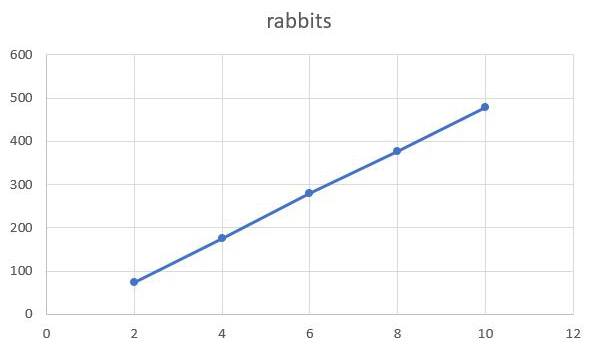

## Імітаційне моделювання комп'ютерних систем
## СПм-21-2, Іваненко Юлія Вікторівна
### Лабораторна робота №1. Опис імітаційних моделей
 

## Обрана модель в середовищі NetLogo:
[Rabbits Grass Weeds](http://www.netlogoweb.org/launch#http://www.netlogoweb.org/assets/modelslib/Sample%20Models/Biology/Rabbits%20Grass%20Weeds.nlogo)
 

### Вербальний опис моделі:
Симуляція екосистеми, що складається з кроликів, трави та бур'янів. Кролики пересуваються рандомним чином, трава та бур'яни ростуть також рандомно.

Коли кролик натикається на траву або бур'ян, він з'їдає це і отримує енергію. Якщо кролик набирає достатньо енергії, він розмножується. Якщо він не отримує достатньо енергії, він вмирає.

Траву та бур'яни можна налаштувувати так, щоб вони росли з різною швидкістю та давали кроликам різну кількість енергії. Модель можна використовуватиме для вивчення конкурентних переваг цих змінних.
Модель демонструє, як може змінюватися популяція. 

### Керуючі параметри:
- **number** визначає кількість агентів у середовищі моделювання, тобто, в даній моделі, початкова кількістю кроликів.
- **birth-threshold** визначає рівень енергії, при якому агенти (кролики) розмножуються.
- **grass-grow-rate** визначає швидкість росту трави.
- **grass-energy** визначає кількість енергії, яку дає трава.
- **weeds-grow-rate** визначає швидкість зростання бур'янів.
- **weed-energy** визначає кількість енергії, яку дає бур'ян.

### Внутрішні параметри:
- **energy**. Показник енергії у кролика. При симуляції кролику присвоюється рандомний показник енергії. 

### Критерії ефективності системи:
- Популяція кроликів
- Популяція трави
- Популяція бур'яну

### Примітки:
При переміщенні кролики втрачають трохи енергії. При наданні потомства втрачається багато енергії. Кролик помирає, якщо енергія закінчується. 

### Недоліки моделі:
В одному місці можуть знаходитися більше одного кролика.

 

## Обчислювальні експерименти

### 1. Вплив енергетичності трави на середню кількість популяції кроликів

Дослідимо залежність середньої кількості популяції кроликів протягом заданої кількості тактів від енергетичності трави, яку будемо змінювати у процесі симуляції. Експеримент при **grass-energy** від 2 до 10 з шагом 2 одиниці. 

Інші параметри будуть фіксованими: 
- **number**: 150
- **birth-threshold**: 15
- **grass-grow-rate**: 15

<table>
<thead>
<tr><th>Енергетичність трави</th><th>Середнє число популяції кроликів</th></tr>
</thead>
<tbody>
<tr><td>2</td><td>72,69</td></tr>
<tr><td>4</td><td>175,79</td></tr>
<tr><td>6</td><td>278,84</td></tr>
<tr><td>8</td><td>377,16</td></tr>
<tr><td>10</td><td>477,80</td></tr>
</tbody>
</table>

Графік наочно показує, що при збільшені енергетичності трави, популяція кроликів лінійно збільшується. 

### 2. Залежність середньої кількості популяції кроликів від порога народжуваності 
Дослідимо залежність середньої кількості популяції кроликів від порога народжуваності при фіксованому параметрі енергетичності трави. Поріг народжуванності буде змінюватися наступним чином: 4, 8, 12, 16 та 20. Всього 5 симуляцій, кожна по 1000 тіків. 

Параметри системи, при яких здійснювалась симуляція:

- **number**: 150
- **grass-energy**: 5
- **grass-grow-rate**: 15

<table>
<thead>
<tr><th>Поріг народжуваності</th><th>Середнє число популяції кроликів</th></tr>
</thead>
<tbody>
<tr><td>4</td><td>234,49</td></tr>
<tr><td>8</td><td>227,34</td></tr>
<tr><td>12</td><td>230,09</td></tr>
<tr><td>16</td><td>224,48</td></tr>
<tr><td>20</td><td>225,36</td></tr>
</tbody>
</table>

Графік демонструє, що при збільшені порогу народжуванності, стрибкоподібно зменшується популяція кроликів.

### 3. Залежність середньої кількості трави від кількості кроликів 

Дослідимо залежність середньої кількості популяції трави від кількості кроликів.
Експеримент буде проходити при **number** = 10, 50, 150, 250, 500 кроликах, та фіксованих параметрах системи:

- **birth-threshold**: 15
- **grass-energy**: 5
- **grass-grow-rate**: 15

Всього 5 симуляцій, кожна по 1000 тіків. 

<table>
<thead>
<tr><th>Кількість кроликів</th><th>Середнє число популяції трави</th></tr>
</thead>
<tbody>
<tr><td>10</td><td>44,96</td></tr>
<tr><td>50</td><td>43,03</td></tr>
<tr><td>150</td><td>41,85</td></tr>
<tr><td>250</td><td>41,23</td></tr>
<tr><td>500</td><td>40,37</td></tr>
</tbody>
</table>

Графік демонструє, що при збільшенні кількості кроликів, кількіть трави зменшується логарифмічно.

 

У ході експериментів було виявлено, що спочатку кроликам не вистачає трави, і багато кроликів гине. Але це дозволяє траві вільно рости, що забезпечує достатню кількість їжі для кролів, що залишилися живими. Кролики отримують енергію і розмножуються. 

Велика кількість кроликів призводить до нестачі трави, і цикл починається знову.

Популяція кролів проходить через затухаючі коливання, зрештою стабілізуючись у вузькому діапазоні. Загальна кількість трави також коливається, не збігаючись із популяцією кроликів.

