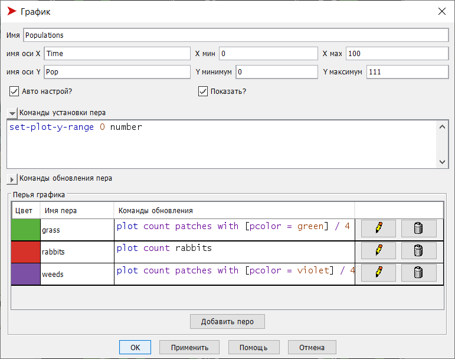
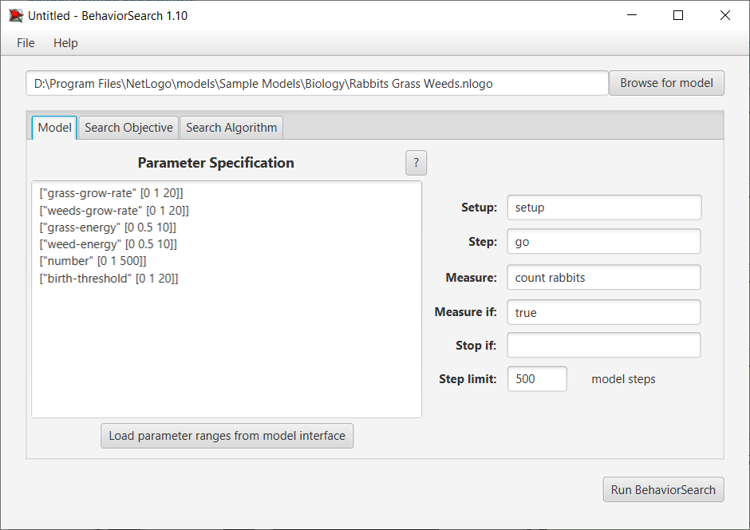
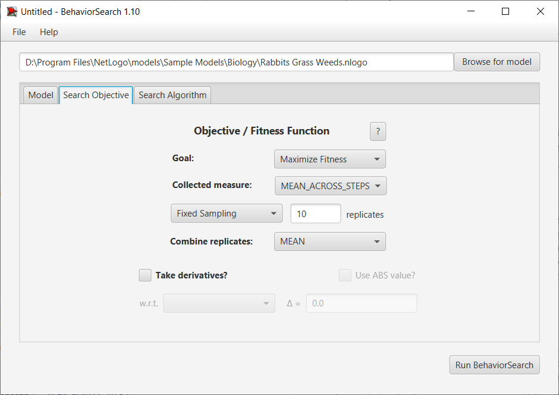
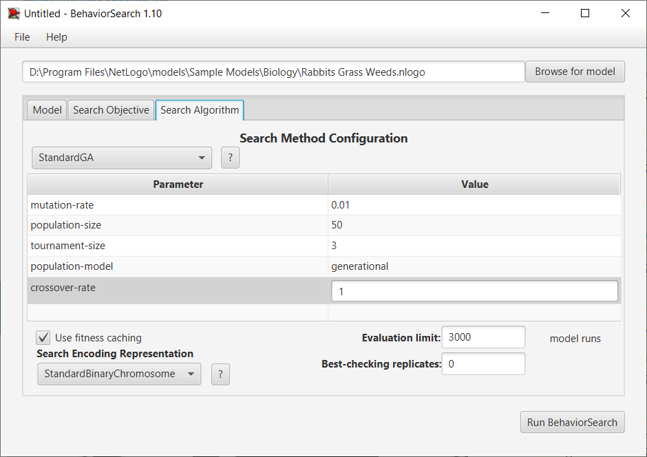
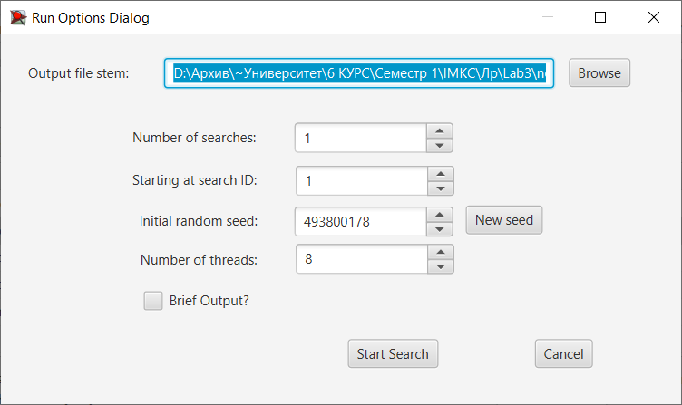
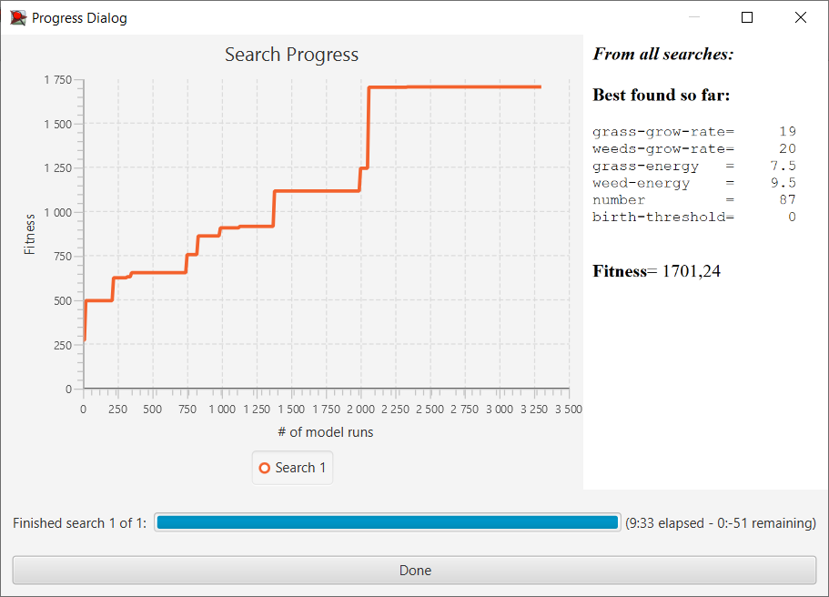
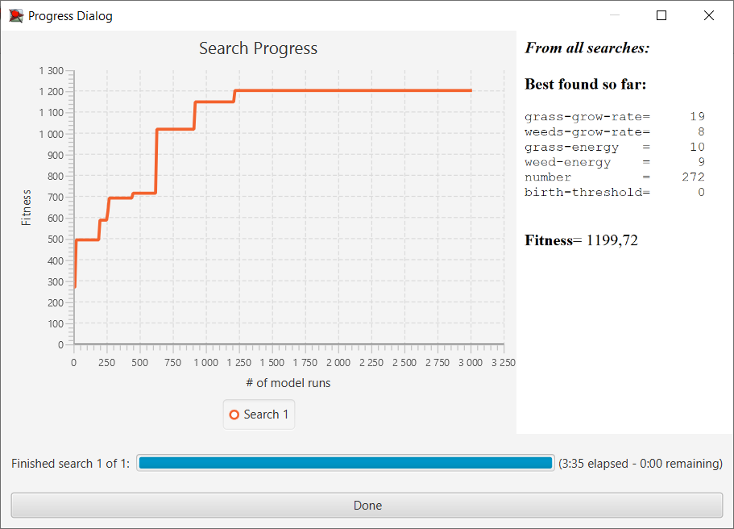

## Імітаційне моделювання комп'ютерних систем
## СПм-21-2, Іваненко Юлія Вікторівна
### Лабораторна робота №3. Використання засобів обчислювального інтелекту для оптимізації імітаційних моделей
 

## Обрана модель в середовищі NetLogo:
[Rabbits Grass Weeds](http://www.netlogoweb.org/launch#http://www.netlogoweb.org/assets/modelslib/Sample%20Models/Biology/Rabbits%20Grass%20Weeds.nlogo)
 

### Вербальний опис моделі:

Симуляція екосистеми, що складається з кроликів, трави та бур'янів. Кролики пересуваються рандомним чином, трава та бур'яни ростуть також рандомно.

Коли кролик натикається на траву або бур'ян, він з'їдає це і отримує енергію. Якщо кролик набирає достатньо енергії, він розмножується. Якщо він не отримує достатньо енергії, він вмирає.

Траву та бур'яни можна налаштувувати так, щоб вони росли з різною швидкістю та давали кроликам різну кількість енергії. Модель можна використовуватиме для вивчення конкурентних переваг цих змінних.
Модель демонструє, як може змінюватися популяція. 

### Керуючі параметри:
- **number** визначає кількість агентів у середовищі моделювання, тобто, в даній моделі, початкова кількістю кроликів.
- **birth-threshold** визначає рівень енергії, при якому агенти (кролики) розмножуються.
- **grass-grow-rate** визначає швидкість росту трави.
- **grass-energy** визначає кількість енергії, яку дає трава.
- **weeds-grow-rate** визначає швидкість зростання бур'янів.
- **weed-energy** визначає кількість енергії, яку дає бур'ян.

### Внутрішні параметри:
- **energy**. Показник енергії у кролика. При симуляції кролику присвоюється рандомний показник енергії. 

### Критерії ефективності системи:
- Популяція кроликів
- Кількість трави
- Кількість бур'яну

## Налаштування середовища BehaviorSearch:

**Вибрана модель**:
<pre>
D:\Program Files\NetLogo\models\Sample Models\Biology\Rabbits Grass Weeds.nlogo
</pre>

**Параметри моделі**:

<pre>
["grass-grow-rate" [0 1 20]]
["weeds-grow-rate" [0 1 20]]
["grass-energy" [0 0.5 10]]
["weed-energy" [0 0.5 10]]
["number" [0 1 500]]
["birth-threshold" [0 1 20]]
</pre>

Використана міра:
 
Для фітнес-функції було обрано середнє значення популяції кроликів, вираз для її розрахунку взято з налаштувань графіка аналізованої імітаційної моделі в середовищі NetLogo

та вказано у параметрі "**Measure**":

<pre>
count rabbits
</pre>

Ссереднє значення популяції кроликів повинно враховуватися в середньому за весь період симуляції тривалістю 500 тактів (адже на кожному такті є своє поточне середнє значення  кількості кроликів), починаючи з 0 такту симуляції.

У даному випадку параметр зупинки за умовою ("**Stop if**") не використовувався.
Загальний вигляд вкладки параметрів:

**Налаштування цільової функції** (Search Objective):
Метою підбору параметрів імітаційної моделі, що описує розвиток популяції кроликів при різних параметрах, є максимізація значення середньої кількості кроликів - це вказано через параметр "Goal" зі значенням Maximize Fitness. 
Тобто необхідно визначити такі параметри налаштувань моделі, при яких умови для розмноження кроликів будуть найбільш сприятливі.

 При цьому цікавить не просто середня кількість всіх кроликів у якийсь окремий момент симуляції, а середнє її значення за всю симуляцію.
 Для цього у параметрі "**Collected measure**", що визначає облік значень вибраного показника, зазначено **MEAN_ACROSS_STEPS**.

Загальний вигляд вкладки налаштувань цільової функції:

**Налаштування алгоритму пошуку** (Search Algorithm):

У ході дослідження на лабораторній роботі буде використовуватися два алгоритми: Випадковий пошук (RandomSearch) і Простий генетичний алгоритм (StandardGA).

Для цих алгоритмів, що вирішують задачу пошуку такого набору параметрів імітаційної моделі, щоб задовольнити вимоги користувача, необхідно вказати "**Evaluation limit**" (число ітерацій пошуку, у разі ГА - це буде число поколінь), і "**Search Space Encoding Representation**" (спосіб кодування варіанта рішення). Був обраний спосіб кодування StandartBinaryChromosome.

Загальний вид вкладки параметрів алгоритму пошуку:

 

### Результати використання BehaviorSearch:
Діалогове вікно запуску пошуку:

Результат пошуку параметрів імітаційної моделі, використовуючи **генетичний алгоритм**:

Результат пошуку параметрів імітаційної моделі, використовуючи **випадковий пошук**:

Результати суттєво відрізняються. Час затрачений на пошук параметрів генетичним алгоритмом був у декілька разів більше ніж випадковим пошуком. Але і результат вийшов кращим при використані генетичного алгоритма. 
В даному випадку, краще витрати більше часу на пошук параметрів, які забезпечать найбільш сприятливі умови для розмноження кроликів, та отримати кращий результат фітнес-функції. 